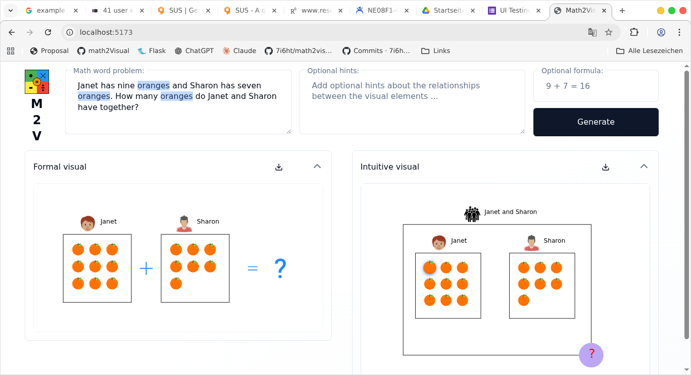
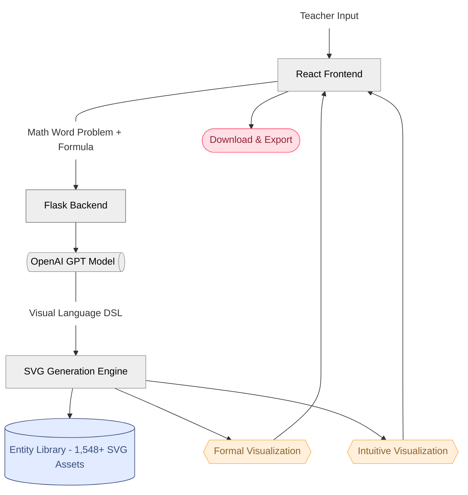

#  Math2Visual Interactive System

An interactive educational platform that transforms math word problems (MWPs) into pedagogically meaningful visual representations for enhanced learning and teaching.

## 🎯 Overview

The Math2Visual Interactive System targets educators. It allows to automatically create engaging visuals from textual math problems, supporting diverse learning styles and improving mathematical comprehension.
The tool generates two different types of visualizations for an MWP given:

- **Formal Representation**: Exact quantities and explicit mathematical operations
- **Intuitive Representation**: Natural visual groupings / arrangements that emphasize real-world context

## 🔬 Research Foundation

This interactive system builds upon the Math2Visual research framework:

- **Research Paper**: [Math2Visual: Automatic Pedagogically Meaningful Visual Representations for Math Word Problems](https://arxiv.org/pdf/2506.03735)
- **Original Repository**: [Math2Visual on GitHub](https://github.com/eth-lre/math2visual)
- **ETH AI Center**: [ETH AI Center](https://ai.ethz.ch/)
- **PEACH Lab**: [PEACH Lab (ETH)](https://peach.ethz.ch/)
- **LRE Lab**: [ETH Learning Research & Education Lab](https://lre.ethz.ch/)

### Key Innovations

- **Framework for automated visual generation from MWPs**:
   1. Scalable for
diverse narrative structures found in MWPs.
   2. Automation of time-consuming manual process.
- **Pedagogically Meaningful Design**: Design of visuals validated with teachers.

## 🧮 User Interface



## 📚 Usage Workflow

1. **Enter Problem**: Type your math word problem in the main text area
   ```
   "Janet has 9 oranges and Sharon has 7 oranges. How many oranges do they have together?"
   ```

2. **Add Formula** (Optional): Include the mathematical formula
   ```
   "9 + 7 = 16"
   ```

3. **Generate**: Click "Generate Visualization" and watch the AI processing

4. **Review Results**: Examine both formal and intuitive visual representations

5. **Refine if Needed**: Edit the generated Visual Language (DSL) and regenerate

6. **Export**: Download visualizations in your preferred format

## 📁 Project Structure

```
math2visual/
├── backend/                  # Flask backend application
│   ├── app/                  # Main application package
│   │   ├── api/              # API layer (routes, middleware)
│   │   ├── config/           # Configuration management
│   │   ├── models/           # Data models
│   │   ├── services/         # Business logic (generation, validation, etc.)
│   │   └── utils/            # Utility functions
│   ├── app.py                # Application entry point (development)
│   ├── wsgi.py               # WSGI entry point (production, for Gunicorn)
│   ├── gunicorn.conf.py      # Gunicorn WSGI server configuration
│   ├── requirements.txt      # Python dependencies
│   ├── storage/              # Local storage directory
│   │   ├── datasets/svg_dataset/  # SVG entity library (1,549 files)
│   │   ├── models/           # ML model checkpoints
│   │   ├── output/           # Generated visualizations
│   │   └── analytics/        # Analytics data storage
│   ├── scripts/              # Setup and management scripts
│   ├── docs/                 # Backend documentation
│   │   ├── PRODUCTION_DEPLOYMENT.md
│   │   ├── JUICEFS_SETUP.md
│   │   ├── CLAMAV_SETUP.md
│   │   └── ANALYTICS_SETUP.md
│   ├── config_templates/     # Configuration templates
│   └── tests/                # Test suite
├── frontend/                 # React frontend application
│   ├── src/                  # Source code
│   │   ├── api_services/     # Backend API integration
│   │   ├── components/       # React components
│   │   ├── config/           # Configuration files
│   │   ├── contexts/         # React Context providers
│   │   ├── hooks/            # Custom React hooks
│   │   ├── services/         # Module-level services
│   │   ├── lib/              # Library utilities
│   │   ├── schemas/          # Validation schemas
│   │   ├── styles/           # Global styles
│   │   ├── types/            # TypeScript type definitions
│   │   └── utils/            # Utility functions
│   ├── public/               # Static assets
│   ├── dist/                 # Production build output (generated)
│   ├── docs/                 # Frontend documentation
│   │   └── PRODUCTION_DEPLOYMENT.md
│   ├── package.json          # Dependencies and scripts
│   ├── vite.config.ts        # Vite build configuration
│   └── tailwind.config.js    # Tailwind CSS configuration
├── images/                   # Project images and assets
├── package.json              # Root package.json (for convenience scripts)
└── README.md                 # This file
```

For detailed structure information, see:
- **[Backend Structure](backend/README.md#-project-structure)**: Complete backend file organization
- **[Frontend Structure](frontend/README.md#-project-structure)**: Complete frontend file organization

## 🏛️ System Overview



### Frontend (React + TypeScript)
- **Technologies**: React 19, Vite, ShadCN and Tailwind CSS
- **Text-To-Image (TTI) Visual Generation**: Generating two types of visualization (intuitive, formal) representing MWP
- **Visual Language Editing**: Direct modification and regeneration capabilities
- **Interactive SVG Management**: Search, upload, and manage SVG entities with popup-based interactions
- **Multi-format Export**: Download visualizations as SVG, PNG or PDF

### Backend (Flask + Python)
- **AI-Powered Processing**: OpenAI GPT integration for natural language to visual language conversion
- **Dual Generation Engines**: Separate formal and intuitive visualization algorithms
- **Scalable Storage**: Local filesystem or distributed JuiceFS with PostgreSQL metadata
- **SVG Uploading Security & Validation**: SVG content validation, and optional ClamAV integration
- **Extensive SVG Entity Library**: 1,549 pre-validated SVG assets for comprehensive visual coverage

## 🚀 Quick Start

### Prerequisites

- **Python 3.12+** with conda/pip
- **Node.js 18+** with npm
- **PostgreSQL 13+** (for distributed storage)
- **OpenAI API Key** (for GPT-powered language generation)

### System Setup

1. **Clone the repository**
   ```bash
   git clone https://github.com/7i6ht/math2visual.git
   cd math2visual
   ```

2. **Backend Setup**
   ```bash
   cd backend/
   # Install Python dependencies
   pip install -r requirements.txt
   ```

   Update `.env` file with required environment variables:
   ```bash
   # OpenAI Configuration
   OPENAI_API_KEY=your_openai_api_key

   # Storage Configuration
   SVG_STORAGE_MODE=local  # or 'juicefs'
   SVG_DATASET_PATH=/path/to/svg/dataset
   SVG_CACHE_SIZE=100

   # JuiceFS Configuration (only if using JuiceFS)
   See ([`docs/JUICEFS_SETUP.md`](docs/JUICEFS_SETUP.md))
   
   Start backend server
   ```bash
   python app.py
   ```
   Backend will run on `http://localhost:5000`

3. **Frontend Setup**
   ```bash
   cd frontend/
   # Install Node.js dependencies
   npm install
   
   # Start development server
   npm run dev
   ```
   Frontend will be available at `http://localhost:5173`

4. **Access the Application**
   
   Open your browser to `http://localhost:5173` and start generating visualizations!

## 📖 Documentation

### Frontend
- **[Frontend README](frontend/README.md)**: React application structure, component usage, and development workflows
- **[Frontend Production Deployment](frontend/docs/PRODUCTION_DEPLOYMENT.md)**: Production deployment guide for the React frontend

### Backend
- **[Backend README](backend/README.md)**: Comprehensive Flask API reference, storage configuration, and deployment guides
- **[Backend Production Deployment](backend/docs/PRODUCTION_DEPLOYMENT.md)**: Production deployment guide with Gunicorn
- **[JuiceFS Setup Guide](backend/docs/JUICEFS_SETUP.md)**: Distributed storage configuration
- **[Security Setup Guide](backend/docs/CLAMAV_SETUP.md)**: ClamAV antivirus integration
- **[Analytics Setup Guide](backend/docs/ANALYTICS_SETUP.md)**: User analytics and tracking setup


## 📄 License

This project builds upon the Math2Visual research framework. Please refer to the [original repository](https://github.com/eth-lre/math2visual) for licensing information and academic use guidelines.

## 🙏 Credits

This code base was developed with the assistance of:

- **[Cursor AI](https://cursor.sh/)**: AI-powered code editor that enhanced development productivity and code quality (using various available models)
- **[Claude (Anthropic)](https://www.anthropic.com/claude)**: AI assistant that provided intelligent code generation, debugging support, architectural guidance, in addition to generation of documentation

---

*Transform mathematical learning through the power of AI-generated visualizations.* ✨
